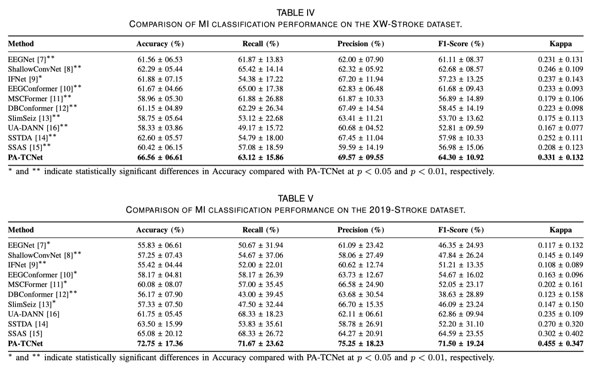

# PA-TCNet


## Paper Title
PA-TCNet: Pathology-Aware Temporal Calibration with Physiology-Guided Target Refinement for Cross-Subject Motor Imagery EEG Decoding in Stroke Patients


## Results
The experimental and visualization results are presented below.



## Environment
Code developed and tested in Python 3.12.12 using PyTorch 2.5.1.
```
Python      : 3.12.12
PyTorch     : 2.5.1
CUDA        : 12.4
Device      : cuda
```

## Datasets
The experiments are conducted on publicly available datasets, which can be accessed at:
XW-Stroke: https://doi.org/10.6084/m9.figshare.21679035.v5 
2019-Stroke: https://doi.org/10.6084/m9.figshare.7636301

## Citation
If you find our codes helpful, please star our project and cite our following papers:
```
@misc{wang2026patcnetpathologyawaretemporalcalibration,
      title={PA-TCNet: Pathology-Aware Temporal Calibration with Physiology-Guided Target Refinement for Cross-Subject Motor Imagery EEG Decoding in Stroke Patients}, 
      author={Xiangkai Wang and Yun Zhao and Dongyi He and Qingling Xia and Gen Li and Nizhuan Wang and Ningxiao Peng and Bin Jiang},
      year={2026},
      eprint={2604.16554},
      archivePrefix={arXiv},
      primaryClass={cs.CV},
      url={https://arxiv.org/abs/2604.16554}, 
}
```
