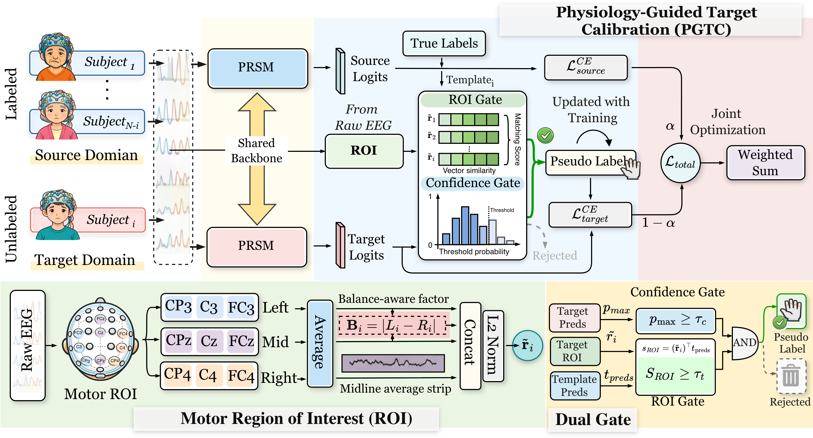
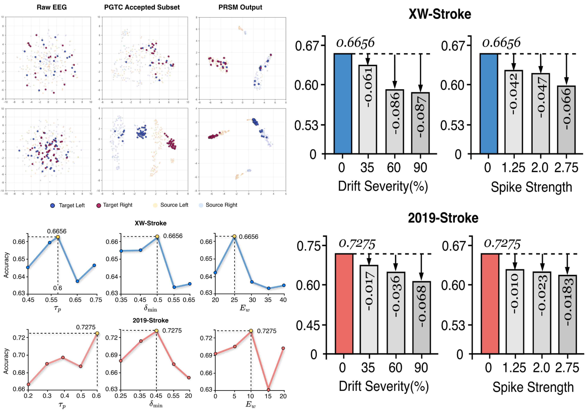

## PA-TCNet

### Paper Title

PA-TCNet: Pathology-Aware Temporal Calibration with Physiology-Guided Target Refinement for Cross-Subject Motor Imagery EEG Decoding in Stroke Patients

### PGTC & PRSM




## Results

The experimental and visualization results are presented below.



## Configuration

| Argument                        |           Default | Meaning                                                      |
| ------------------------------- | ----------------: | ------------------------------------------------------------ |
| `--dataset`                     |        `XW_30Chs` | Dataset name. It is used to select `data_config.params[args.dataset]` and to choose the matching dataloader. |
| `--exp-name`                    | `pgtc_adaptation` | Experiment label used in result filenames and logs.          |
| `--epochs`                      |             `200` | Maximum number of training epochs for each LOSO fold.        |
| `--batch-size`                  |              `64` | Batch size for source, target-calibration, and target-evaluation dataloaders. |
| `--eval-batch-size`             |              `64` | Reserved evaluation batch-size field. The current exported loader construction still uses `--batch-size`. |
| `--lr`                          |           `0.001` | Adam optimizer learning rate.                                |
| `--weight-decay`                |           `0.001` | Adam optimizer weight decay.                                 |
| `--patience`                    |              `30` | Early-stopping patience based on validation loss.            |
| `--seed`                        |               `2` | random seeds                                                 |
| `--alpha`                       |            `0.95` | Source/target loss balance after PGTC warmup. The training loss is `alpha * source_loss + (1 - alpha) * target_loss`. |
| `--pgtc-confidence-threshold`   |            `0.90` | Minimum model confidence required before a target sample can receive a calibrated target. |
| `--roi-threshold-floor`         |            `0.70` | Lower bound for ROI-template similarity thresholds.          |
| `--pgtc-warmup-epochs`          |              `10` | Number of source-only warmup epochs before PGTC target calibration is enabled. |
| `--emb-size`                    |              `30` | Token embedding dimension used by PA-TCNet and PRSM.         |
| `--depth`                       |               `2` | Number of stacked PRSM blocks in the temporal backbone.      |
| `--temporal-filters-per-branch` |              `10` | Number of temporal filters in each multi-scale temporal branch of the local sensorimotor encoder. |
| `--spatial-multiplier`          |               `3` | Expansion factor for depthwise spatial filtering after temporal feature extraction. |
| `--pooling-size1`               |               `8` | First temporal pooling size in the local sensorimotor encoder. |
| `--pooling-size2`               |               `8` | Second temporal pooling size before token projection.        |
| `--dropout`                     |             `0.5` | Dropout rate used in the encoder and PRSM blocks.            |
| `--subset-subjects`             |               `0` | If greater than zero, only the first N subjects in `sub_list` are used. This is mainly for quick checks. |
| `--override-sub-list`           |            `None` | Optional explicit subject-id list for LOSO evaluation. It replaces the default subject list. |
| `--fast-dev-run`                |           `False` | Quick debugging switch. It limits epochs to at most 8, keeps only two subjects, and limits PGTC warmup to at most 2 epochs. |

## Environment

Code developed and tested in Python 3.12.12 using PyTorch 2.5.1.
```
Python      : 3.12.12
PyTorch     : 2.5.1
CUDA        : 12.4
Device      : cuda
```

## Datasets
The experiments are conducted on publicly available datasets, which can be accessed at:
XW-Stroke: https://doi.org/10.6084/m9.figshare.21679035.v5 

2019-Stroke: https://doi.org/10.6084/m9.figshare.7636301

## Citation
If you find our codes helpful, please star our project and cite our following papers:
```
@misc{wang2026patcnetpathologyawaretemporalcalibration,
      title={PA-TCNet: Pathology-Aware Temporal Calibration with Physiology-Guided Target Refinement for Cross-Subject Motor Imagery EEG Decoding in Stroke Patients}, 
      author={Xiangkai Wang and Yun Zhao and Dongyi He and Qingling Xia and Gen Li and Nizhuan Wang and Ningxiao Peng and Bin Jiang},
      year={2026},
      eprint={2604.16554},
      archivePrefix={arXiv},
      primaryClass={cs.CV},
      url={https://arxiv.org/abs/2604.16554}, 
}
```
